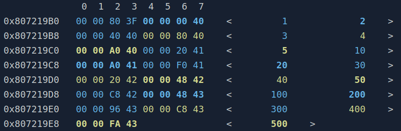
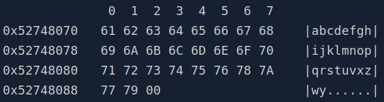

# Logging
\tableofcontents

Hermes provides 4 streams of log messages: `info`, `warn`, `error` and
`critical`. In practice, they just have different console colors
(although in the future I may actually add some features here). The
class taking care of logging is `hermes::Log`, but the easiest and
recommended way to perform logging is by using the macros.

```cpp
HERMES_LOG(FMT, ...);
HERMES_LOG_WARNING(FMT, ...);
HERMES_LOG_ERROR(FMT, ...);
HERMES_LOG_CRITICAL(FMT, ...);
```

`FMT` is your logging message that can be formatted to include variable
values - just like `printf`. However, it does not follow `printf`'s
directives. `hermes::Log` functions format strings in a more simple way
assuming that every argument will accept `std::stringstream` << operator
(i.e., your variables must work with `std::cout` for example). To put
an argument inside your message, you use `{}`, like this:
```cpp
HERMES_LOG_ERROR("{} errors in {}", 3, "foo");
// this will log the message
// "3 errors in foo"
```

By using the macros above, Hermes will prefix your messages with a label
containig file location, function name, line number, time and log stream.
So the message above would probably appear like this:
```text
[2022-01-18 14:23:26] [error] [../my_code.cpp][35][foo] 3 errors in foo
```
You can customize the label and the colors by configuring `hermes::Log`
variables and options:
```cpp
#include <hermes/common/debug.h>
int main() {
  // tell hermes to abbreviate file path locations and
  // output colored messages
  hermes::Log::addOptions(hermes::log_options::abbreviate |
                          hermes::log_options::use_colors);
  // choose warn message colors
  hermes::Log::warn_color = 123; // value in [0,255]
  HERMES_LOG_WARNING("warning message!");
  return 0;
}
```
> You can choose among 256 colors, commonly used in terminals. You can consult them [here](https://misc.flogisoft.com/bash/tip_colors_and_formatting) in the _88/256 Colors_ section.

Sometimes you just want to log a code location while debugging to check if the
coding is getting there, or simply log variables. Here is what you can do in
those situations:
```cpp
// log just the code location
HERMES_PING
// log a variable like: variable_name = value
HERMES_LOG_VARIABLE(variable_name);
// log multiple variable values in the same line
HERMES_LOG_VARIABLES(...);
```

In case of logging in a `CUDA` code, you will not be able to use any of the
macros above, you will have to use `printf`. The following macros do that
for you:
```cpp
// outputs to stdout
HERMES_C_LOG(FMT,...);
// outputs to stderr
HERMES_C_LOG_ERROR(FMT,...);
// for convenience, the following macros do the same
// outputs to stdout
HERMES_C_DEVICE_LOG(FMT,...);
// outputs to stderr
HERMES_C_DEVICE_ERROR(FMT,...);
```
> Note that in `FMT` now follows `printf` format options!

Finally, you may also intercept the log output as well. `hermes::Log`
allows you to register callbacks to intercept log messages:
```cpp
#include <hermes/common/debug.h>
int main() {
  // register a warn stream callback
  hermes::Log::warn_callback = [](const hermes::Str& message) {
    // handle message
  };
  // you can also fully redirect messages to your callbacks this way
  hermes::log::addOptions(hermes::log_options::callback_only);
  HERMES_LOG_WARNING("this message will not appear in console!");
  return 0;
}
```

## Memory Prints
Sometimes you want to actually analyse how data is arranged
in memory, with addresses, alignments, and etc. `hermes::MemoryDumper` is a very useful tool for
printing memory footprints like this:
```shell
              0  1  2  3  4  5  6  7   8  9  A  B  C  D  E  F  10 11 12 13 14 15 16 17 
0x4C139960   00 00 00 00 00 00 00 00  01 00 00 00 00 00 00 00  02 00 00 00 00 00 00 00 
0x4C139978   03 00 00 00 00 00 00 00  04 00 00 00 00 00 00 00  05 00 00 00 00 00 00 00 
0x4C139990   06 00 00 00 00 00 00 00  07 00 00 00 00 00 00 00                          
```
You can reproduce the result above with this code:
```cpp
#include <hermes/logging/memory_dump.h>

int main() {
  u64 v[] = {0, 1, 2, 3, 4, 5, 6, 7};
  hermes::MemoryDumper::dump(v, 8, 24);
  return 0;
}
```
For complex data arrangements you can define memory regions with colors to help your 
visualization. This is done by creating a `hermes::MemoryDumper::RegionLayout` instance and
passing it to the `dump` function used in the example above. Here is an example of 
how to describe memory regions:
```cpp
// imagine your data type is a struct like this:
struct S {
  hermes::vec3 v;      // floats {x, y, z}
  hermes::point2 p;    // floats {x, y, z}
};
// 
// imagine now that you have an array with 3 instances of S
// and the following elements
S v[3] = {{{1, 2, 3}, {4, 5}},
          {{10, 20, 30}, {40, 50}},
          {{100, 200, 300}, {400, 500}}};
```

As you can see, we could _color_ all bytes related to field `S::v` and `S::p` to help
our visualization. Here is how we can define our memory layout:
```cpp
using namespace hermes;
// we can construct sequentially our regions, from top to bottom
// so we first start by creating a big region layout containing the entire
// array, by using its size: sizeof(S) * 3
auto layout = MemoryDumper::RegionLayout().withSizeOf<S>(3)
             // then we can define the first sub-region, the field S::v
             // hermes::vec3 provides a base region layout for us, so we may use it and
             // just choose a color, blue
             .withSubRegion(vec3::memoryDumpLayout().withColor(ConsoleColors::blue))
             // the same goes with field S::p, which receives the color yellow
             .withSubRegion(point2::memoryDumpLayout().withColor(ConsoleColors::yellow));
```
> Colors are provided by `hermes::ConsoleColors`.

A region layout may contain sub-region layouts, recursively. This way you can define memory layouts
for complex classes and structures. `hermes::MemoryDumper` also lets you customize its 
output, then you can choose how it shows values for example. A cool feature is to print on the 
side of the memory footprint the values based on their data type. Let's put it all together 
in a single example:
```cpp
#include <hermes/logging/memory_dump.h>
#include <hermes/geometry/vector.h>
#include <hermes/geometry/point.h>

struct S {
  hermes::vec3 v;
  hermes::point2 p;
};

int main() {
  // setup data
  S v[3] = {{{1, 2, 3}, {4, 5}},
            {{10, 20, 30}, {40, 50}},
            {{100, 200, 300}, {400, 500}}};
  // describe data
  auto layout = MemoryDumper::RegionLayout().withSizeOf<S>(3)
      .withSubRegion(vec3::memoryDumpLayout().withColor(ConsoleColors::blue))
      .withSubRegion(point2::memoryDumpLayout().withColor(ConsoleColors::yellow));
  // print out memory
  MemoryDumper::dump(v, 3, 8, layout, 
                     // note the options for printing actual values on the side
                     // and to color the output
                     memory_dumper_options::type_values | memory_dumper_options::colored_output);
  return 0;
}
```



Here are some screenshots of other types of outputs:



